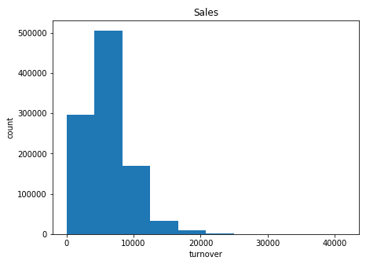
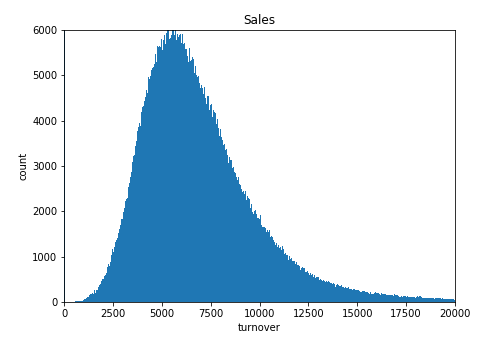
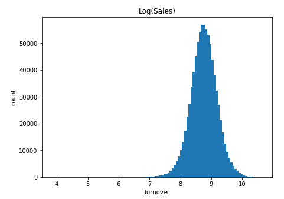
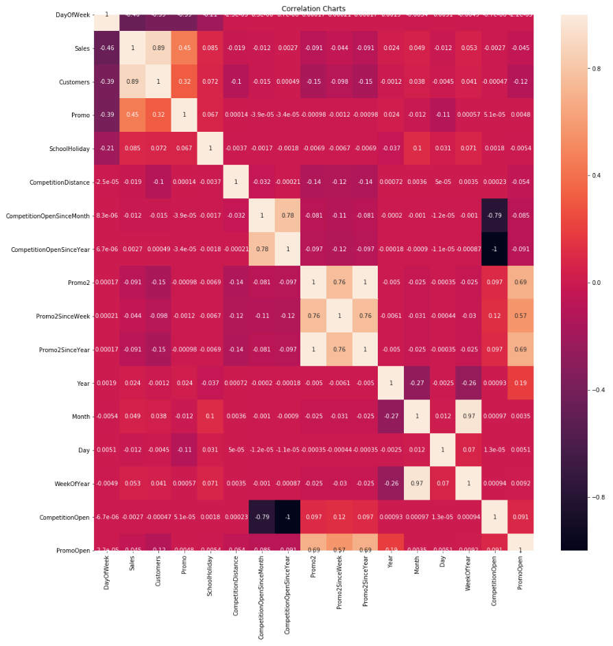
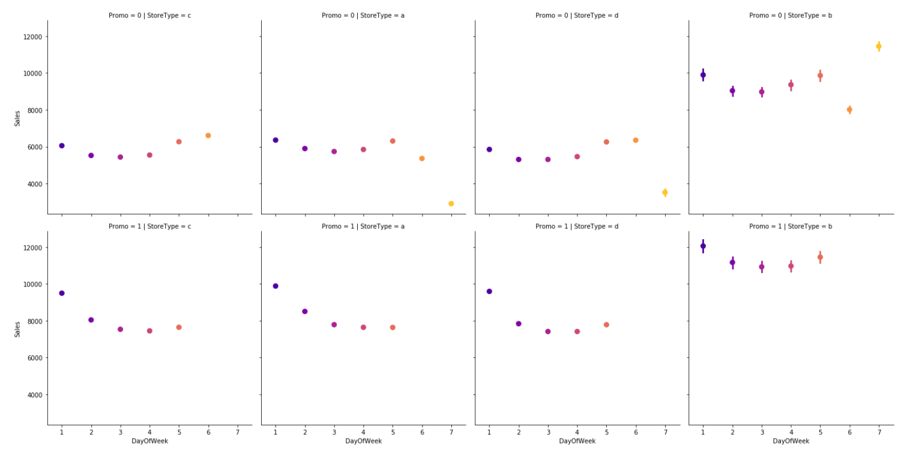
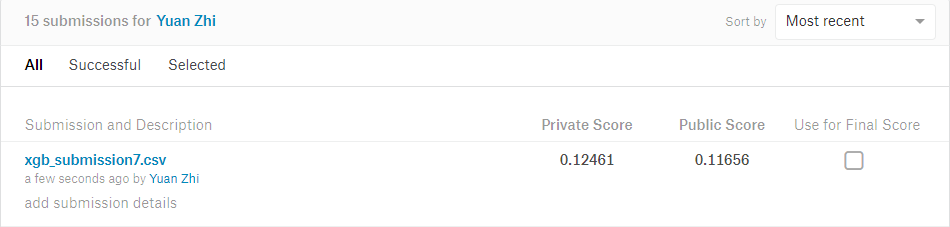
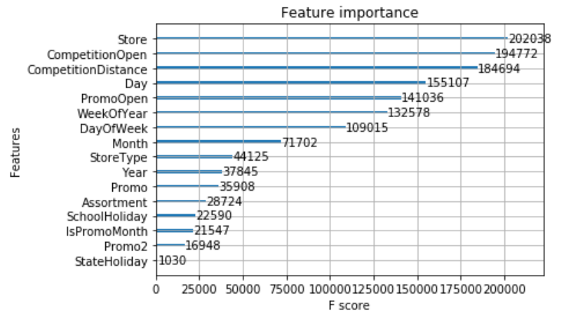

# 机器学习纳米学位
##毕业项目
 优达学城 
 
2019年09月11日

Yuan, Zhi
 

## 1. 问题的定义

项目是针对rosman的历年销售额，进行分析建模以便可以预测未来的销售额。Rossmann是欧洲的一家连锁药店。在这个源自Kaggle比赛Rossmann Store Sales中，我们需要根据Rossmann药妆店的信息（比如促销，竞争对手，节假日）以及在过去的销售情况，来预测Rossmann未来的销售额。解决该问题涉及回归算法领域，数据集使用的rosman提供的销售数据以及门店信息数据。

### 1.1 项目概述

本项目来源于Kaggle竞赛Rossmann Store Sales。 Rossmann是德国首家平价日用商品，在欧洲拥有3000多分店。本项目所要解决的问题是，提前6周预测1115家商店的日常销售额。

### 1.2 研究内容
项目是一个有监督的回归问题，输入的数据由特征数据构成，目标是特征数据的预测销售额。需要对项目的输入数据进行特征处理，获取相关的数据来训练回归模型。通过最后的模型训练，可以有效的对未来的数据进行预测。我们将采用 XGBoost与 LightGBM方法，对1115家商店未来6周的销售额进行预测。为了达到最终的目标，可以将问题分解以下几个方面：
1). 探索性数据分析，观察数据的特征，记录清洁度以及质量问题，是否存在缺失值和异常，分析特征之间的关系。
2). 特征工程，对特征进行预处理，选择对销售额预测影响比较大的特征，基于原始特征去构建与销售额更为相关的新特征。
3). 建立基准模型及模型优化，建立基准模型并对模型的参数进行调节，提高模型的性能，尝试组合不通的模型进一步提高预测精度和泛化能力

### 1.3 评价指标
根据Kaggle竞赛所提供的信息，评估标准采用RMSPE均方根百分误差：均方根百分比误差(Root Mean Square Percentage Error)。 
$$RMSPE=\sqrt{\frac{1}{n} \sum_{i=1}^{n}\left(\frac{y_{i}-\hat{y}_{i}}{y_{i}}\right)}$$
RMSPE更贴近误差的概念。而相比于 MSE 和 RMSE， RMSPE 计算的是一个误差率，这样就避免了真实值之间大小的不同而对误差产生的影响。
## 2. 分析

### 2.1 数据的探索
#### 2.2.1 数据特征

train.csv训练集中包含9个特征，1017209条记录。test.csv测试集中包含了8个特征，41088条记录，少了Sales和Customers 特征，增加了 Id 特征。
train.csv
|特征 | 类型 | 含义 |
| --- | --- | --- |
|Store	      |定量数据|商店编号       |
|DayOfWeek	  |定性数据|星期几         |
|Date	      |定量数据|日期           |
|Sales	      |定量数据|销售额         |
|Customers    |定量数据|客户数量       |
|Open	      |定性数据|是否营业       |
|Promo	      |定性数据|是否促销       |
|StateHoliday |定性数据|是否假日       |
|SchoolHoliday|定性数据|是否是学校假日 |

test.csv
|特征 | 类型 | 含义 |
| --- | --- | --- |
|Id	      |定量数据|编号       |
|Store	      |定量数据|商店编号       |
|DayOfWeek	  |定性数据|星期几         |
|Date	      |定量数据|日期           |
|Open	      |定性数据|是否营业       |
|Promo	      |定性数据|是否促销       |
|StateHoliday |定性数据|是否假日       |
|SchoolHoliday|定性数据|是否是学校假日 |

store.csv
|特征 | 类型 | 含义 |
| --- | --- | --- |
|Store	                      |定量数据|商店编号            |
|StoreType	                  |定性数据|商店类型            |
|Assortment	                  |定性数据|日期类别            |
|CompetitionDistance	      |定量数据|与最近竞争商店的距离|
|CompetitionOpenSinceMonth	  |定量数据|最近竞争商店开张月份|
|CompetitionOpenSinceYear	  |定性数据|最近竞争商店开张年份|
|Promo2	                      |定性数据|是否有持续性的促销活动|
|Promo2SinceWeek	          |定性数据|开始持续性的促销的周|
|Promo2SinceYear	          |定性数据|开始持续性的促销的年|
|PromoInterval                |定性数据|持续性的促销月|

### 2.2 探索性可视化

图1直观的显示了店面的销售额和达到该销售额的店面数量。
图1

图2取原始数据的histogram并调节bin和坐标范围。
 图2
取对数变换，变换后可以看到数据大体呈正态分布。
 图3
图4揭示了sales和其他的特性的直观关联。从图中可知sales 和Customsers 及Promo有很强的相关性。我们可以理解为当店面促销时销售额是会提高的。
图4
图5揭示了sales与DayOfWeek，StoreType，Promo的关系。从图中可知店面类型b的销售额整体交其他种类的店面要高。周一的销售额比其他天数要略高。
图5

### 2.3 算法和技术
#### 2.3.1 算法
根据前面的分析可知，销售额预测本质上是一个回归问题。对于回归的算法有很多，比如线性回归，多项式回归，支持向量机， CART回归树等。这些算法都是机器学习的算法。通过将所需要训练的数据特征转化为特征向量，输出的是预测的最终销售数据。线性回归是求得线性预测的算发，然而对于有这么多特征的数据来说线性划分并不可靠，容易欠拟合。多项式回归能够对于多特征进行有效的拟合预测，可以有效的对特征数据进行分割，模拟。CART是一种二分递归分割的技术，分割方法采用基于最小距离的基尼指数估计函数，将当前的样本集分为两个子样本集，使得生成的的每个非叶子节点都有两个分支。CART算法生成的决策树是结构简洁的二叉树。回归树是针对目标变量是连续性的变量，通过选取最优分割特征的某个值，然后数据根据大于或者小于这个值进行划分进行树分裂最终生成回归树。对于本项目，单一的回归树肯定是不够用的。可以利用集成学习中的boosting框架，对回归树进行改良升级，得到的新模型就是提升树（Boosting Decision Tree），在进一步，可以得到梯度提升树（Gradient Boosting Decision Tree，GBDT），再进一步可以升级到XGBoost。Boosting 是一种可以用来减小监督式学习中偏差的机器学习算法。面对的问题是迈可·肯斯（Michael Kearns）提出的：一组“弱学习者”的集合能否生成一个“强学习者”？弱学习者一般是指一个分类器，它的结果只比随机分类好一点点；强学习者指分类器的结果非常接近真值。大多数提升算法包括由迭代使用弱学习分类器组成，并将其结果加入一个最终的成强学习分类器。加入的过程中，通常根据它们的分类准确率给予不同的权重。加和弱学习者之后，数据通常会被重新加权，来强化对之前分类错误数据点的分类。
在这个项目中主要运用的是xgboost算法。xgboost内部使用的CART tree，这种结构可以处理分类回归问题。而且xgboost的特点是它能够自动利用CPU的多线程进行并行，同时在算法上加以改进提高了精度。也是一种集成方法。集成方法的有点就是采用很多弱学习器最后合并成强学习器，效果会比较好。Xgboost在学习的过程中， 或不断的通过上一次学习的模型的残差进一步学习，最终将损失缩小

#### 2.3.2 XGBoost 介绍和原理
XGBoost 使用CART 回归树作为基学习器，基于加法模型，采用前向分布算法去学习模型，具体的算法推导如下：/2/
第i个样本在第t轮的模型预测值 $\hat{y}_{i}$，保留t-1 轮的模型预测值 $\hat{y}_i
^{t-1}$后，加入一个新的函数$f_{t}(x_i)$，尽可能地让目标函数最大程度地降低。
$$\hat{y}_i^{(0)}=0$$
$$\hat{y}_{i}^{(1)}=f_{1}\left(x_{i}\right)=\hat{y}_{i}^{(0)}+f_{1}\left(x_{i}\right)$$
$$...$$
$$\hat{y}_{i}^{(i)}=\sum_{k=1}^{t}f_{1}\left(x_{i}\right)=\hat{y}_{i}^{(t-1)}+f_{t}\left(x_{i}\right)$$
(2.1)
目标函数定义为：
$$Obj^{(t)}=L^{(t)}=\sum_{i=1}^{n} l\left(y_{i}, \hat{y}\right)+\sum_{i=1}^{t} \Omega\left(f_{i}\right) =\sum_{i=1}^{n} l\left(y_{i}, \hat{y}^{(t-1)}+f_{t}\left(x_{i}\right)\right)+\Omega\left(f_{t}\right)+\text { constant }$$
(2.2)
对上式进行二阶泰勒展开可得：
$$L^{(t)}=\sum_{i=1}^{n}\left[l\left(y_{i}, \hat{y}^{(t-1)}\right)+g_{i} f_{t}\left(x_{i}\right)+\frac{1}{2} h_{i} f_{t}^{2}\left(x_{i}\right)\right]+\Omega\left(f_{t}\right)+\text {constant}$$
(2.3)
上式中 
$$g_{i}=\partial_{\hat{y}_{i}^{(t-1)}} l(y_{i}, \hat{y}_{i}^{(t-1)})$$
$$h_{i}=\partial^2_{\hat{y}_{i}^{(t-1)}} l(y_{i}, \hat{y}_{i}^{(t-1)})$$
除去(2.3)中的常量可得：
$$\tilde{L}^{(t)}=\sum_{i=1}^{n}\left[g_{i} f_{t}\left(x_{i}\right)+\frac{1}{2} h_{i} f_{t}^{2}\left(x_{i}\right)\right]+\Omega\left(f_{t}\right)$$
(2.4)
其中，$f_{t}(x)=w_{q(x)}$, $w \in R^{T}$, $q : R^{d} \rightarrow\{1,2, \cdots, T\}$, w为叶子权重，T为叶子数量。可以将树的复杂度定义为：
$$\Omega(f)=\gamma T+\frac{1}{2} \lambda\|w\|^{2}$$
(2.5)
结合(2.4), (2.5) 可得：
$$\begin{aligned} L^{(t)} & \cong \sum_{i=1}^{n}\left[g_{i} f_{t}\left(x_{i}\right)+\frac{1}{2} h_{i} f_{t}^{2}\left(x_{i}\right)\right]+\Omega\left(f_{t}\right) \\ &=\sum_{i=1}^{n}\left[g_{i} f_{t}\left(x_{i}\right)+\frac{1}{2} h_{i} f_{t}^{2}\left(x_{i}\right)\right]+\gamma T+\lambda \frac{1}{2} \sum_{j=1}^{T} w_{j}^{2} \\ &=\sum_{j=1}^{T}\left[\left(\sum_{i \in I_{j}} g_{i}\right) w_{j}+\frac{1}{2}\left(\sum_{i \in I_{j}} h_{i}+\lambda\right) w_{j}^{2}\right]+\gamma T \end{aligned}$$
(2.6)
设 $G_{j}=\sum_{t\in l_{j}} g_{i}$, $H_{j}=\sum_{t\in l_{j}} h_{i}$, 则有
$$L^{(t)} \cong \sum_{j=1}^{T} G_{j} w_{j}+\frac{1}{2}\left(H_{j}+\lambda\right) w_{j}^{2}+\gamma T$$
(2.7)
假设树得结构q(x)已知, 由上式可以计算出叶子j得最优权重$w^*_{j}$为：
$$w_{j}^{*}=-\frac{G_{j}}{H_{j}+\lambda}$$
(2.8)
由上式可知，最优目标函数值为：
$$L^{(t)}(q)=-\frac{1}{2} \sum_{j=1}^{T} \frac{G_{j}^{2}}{H_{j}+\lambda}+\gamma T$$
(2.9)
上式称为结构分数，可以对树得结构进行评估，分数越小树的结构越好。我们可以利用这个结构分数来列举所有的树结构，从而找到最优解。我们采用贪心算法来找到当前层次的最有结构：
$$Gain=\frac{1}{2}\left[\frac{G_{L}^{2}}{H_{L}+\lambda}+\frac{G_{R}^{2}}{H_{R}+\lambda}-\frac{\left(G_{L}+G_{R}\right)^{2}}{H_{L}+H_{R}+\lambda}\right]-\gamma$$
(2.10)
其中，$\frac{G_{L}^{2}}{H_{L}+\lambda}$ 为左子树分数，$\frac{G_{R}^{2}}{H_{R}+\lambda}$ 为右子树分数，$\frac{\left(G_{L}+G_{R}\right)^{2}}{H_{L}+H_{R}+\lambda}$ 为不可分割时的分数。

#### 2.3.4 技术
本项目使用目前十分流行的基于 Python 语言的 Scikit-learn 机器学习框架以及 XGBoost 和 LightGBM 官方提供的算法接口。Scikit-learn 来源于 2007 年的Google Summer of Code 项目，最初由 David Cournapeau 开发。它是一个简洁、高效的算法库，提供一系列的监督学习和无监督学习的算法，以用于数据挖掘和数据分析。Scikit-learn 的基本功能主要被分为六大部分：分类，回归，聚类，数据降维，模型选择和数据预处理。总体上来说，作为专门面向机器学习的 Python 开源框架，Scikit-learn 可以在一定范围内为开发者提供非常好的帮助。它内部实现了各种各样成熟的算法， 容易安装和使用，样例丰富，而且教程和文档也非常详细。

### 2.4 基准模型
本项目所采用的基准指标是在 Kaggle 上 Private LeaderBoard 的得分，具体来说，对test.csv 中各商店的销售额进行预测，然后将预测结果提交到 Kaggle上， 利用 Kaggle 竞赛Rossmann Store Sales 的 Private LeaderBoard 的得分作为基准， 目标是最终的得分要达到 0.117 及以下。

## 3. 方法

### 3.1 数据预处理
在建模前，我们需要对数据进行预处理，预处理的优劣决定了数据模型效果的上限。利用pandas我们将数据train.csv, test.csv, store.csv 放入表格对象。
#### 3.1.1 数据清理
1. 转换Date为标准数据类型datetime64
2. 对test数据集中的缺失数据进行填补，其中open为1.
3. 对test和train中的其他缺失数据用0进行填充。
4. 去掉open和sales为0的不合理数据。
5. 删除train数据中的Customers, sales。删除test数据中的id。
#### 3.1.2 数据编码

|特征 | 原始类型 | 编码类型 |
| --- | --- | --- |
|StoreType	      |a, b, c, d       |1,2,3,4|
|Assortment	  |a,b,c         |1,2,3|
|StateHoliday |0,a,b,c|0,1,2,3       |
#### 3.1.3 数据重构
1. 将Date分解成Year, Month, Day, WeekofYear
2. 组合特征CompetitionOpenSinceYear, CompetitionOpenSinceMonth及date生成新的特征CompetitionOpen, 表示竞争对手的开业时长。
3. 组合特征Promo2SinceYear, Promo2SinceWeek以及Date生成特征PromoOpen, 表示持续促销开始了多久。
4. 组合特征PromoInterval和date生成新的特征IsPromoMonth来表示单签是否是促销月。这步非常重要，经历了大于20000次的training实验后发现没有这个步骤分数不会达到0.118以下。

### 3.2 执行过程
将经过预处理后的 train训练数据根据时间划分为训练数据以及交叉验证据，在这里取train中后两周的数据作为交叉验证集。使用XGBoost建立回归预测模型。
XGBoost默认参数为：
|参数         |值                     |
| ---         | ---                   |
|booster    |  gbtree                     |
|objective	  |    objective                   |
|eta |        0.3               |
|max_depth |      6                |
|min_child_weight|    1                  |
|subsample         |  1                    |
|colsample_bytree  |  1                    |
|gamma             |  0                    |
|lambda            |  1                    |
|alpha             | 0                     |
|random_state      |  23                   |

### 3.3 优化
我们的策略是从一开始我们使用XGBoost算法的默认参数，然后不断地调整优化参数
来提高分数。我们通过调节模型的复杂度和增加随机性来防止过拟合，我们调节的参数有：eta, max_depth, gamma, min_child_weight, subsample, colsample_bytree, lambda以及alpha。我们利用xgb提供的API cv() 可以对上述部分参数进行甄选。
经过反复运算，我们得到了最终得参数组
XGBoost最优参数为：
|参数         |值                     |
| ---         | ---                   |
|booster    |  gbtree                     |
|objective	  |    objective                   |
|eta |        0.08               |
|max_depth |      10                |
|min_child_weight|    20                  |
|subsample         |  0.9                    |
|colsample_bytree  |  0.6                    |
|alpha             | 1                     |
|random_state      |  23                   |

## 4. 实验结果分析
在我们得到最优参数解组以后我们用了3000轮去训练模型，此时在我们自己生成得验证集上可以得到得训练结果是：

|Model         | train-rmspe            |eval-rmspe |RMSPE|
| ---         | ---                   | --- |  --|                 
|XGBoost    | 0.070007                | 0.087433|0.096514|

将测试及结果上传至kaggle，结果见图

由上图可知我们的最终得分是：0.11656，满足项目要求，也说明我们的模型达到了要求。

## 5. 项目结论

### 5.1 结果可视化
通过建模及优化我们对Rossman的店面进行了成功的预测，下图画出了本项目中各个featue的重要性。

从图中可知店面的销售额和竞争对手的因素是有很大关系的，另一个客观的因素是时间，可以看出顾客的采购也是有惯性和规律的。

### 5.2 对项目的思考
在项目中通过对一些特征的再造我们可以揭示更多的信息，从而极大的提高模型的准确性，这些在数据预处理重要详细考虑。在本项目中，我之前忽略了PromoInterval，这导致我无论怎样优化参数都不能把kaggle分数降到0.118已下，这可能也是udacity设立0.117这个指标的考量之一。这也再次印证了数据的预处理决定了模型结果的上限。

### 5.3 需要作出的改进
从给定的数据中进行更深入的挖掘，我们需要考虑的更多，从kaggle的结果来看，我们的模型和最优的模型还有不小的差距。参数调整方面我们的模型还比较粗线条，可以进行更加细致的调整。模型方面，我们也可以利用更多的方法方案例如mlxtend /8/。

### REF
/1/ https://blog.csdn.net/yinyu19950811/article/details/81079192
/2/ Tianqi Chen,Tong He. Higgs Boson Discovery with Boosted Trees[C]. JMLR: Workshop and Conference Proceedings, 2015 (42): 69-80. 
/3/ https://www.kaggle.com/ananya77041/rossmann-store-sales/randomforestpython/code
/4/ https://www.kaggle.com/danspace/rossmann-store-sales-xgboost/notebook
/5/ https://www.kaggle.com/cast42/xgboost-in-python-with-rmspe-v2
/6/ https://blog.csdn.net/han_xiaoyang/article/details/52665396
/7/ https://xgboost.readthedocs.io/en/latest/parameter.html#parameters-for-linear-booster-booster-gblinear
/8/ http://rasbt.github.io/mlxtend/user_guide/regressor/StackingCVRegressor/

